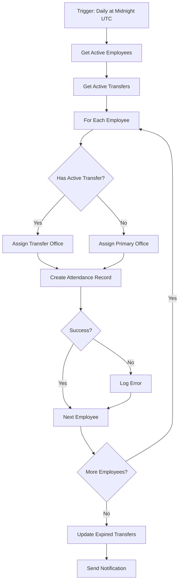

# SharePoint Attendance Tracker

An automated attendance tracking system built on SharePoint Online with Azure Logic Apps integration. This solution handles multi-office employee attendance tracking, including temporary and permanent office transfers.

## Overview

The SharePoint Attendance Tracker automates the daily generation of attendance records for employees across multiple office locations. It integrates with Azure Logic Apps to handle complex workflows including office transfers, daily attendance generation, and automated status updates.

## Key Features

- **Automated Daily Attendance Generation**: Logic App runs daily at midnight UTC to create attendance records
- **Multi-Office Support**: Track employees across multiple office locations (Office A, B, C, D, and Remote)
- **Office Transfer Management**: Handle both temporary and permanent office assignments
- **Employee Master Data**: Centralized employee information with primary office assignments
- **Status Tracking**: Comprehensive attendance status options (Present, Absent, On Leave, Work From Home)
- **Automated Workflows**: Auto-update transfer statuses and expired transfers
- **Error Handling**: Built-in retry mechanisms and error logging
- **Audit Trail**: Track who recorded attendance and when

## System Architecture

### SharePoint Lists

1. **EmployeeMaster**: Stores employee details and primary office assignments
   - EmployeeID, EmployeeName, PrimaryOffice, CurrentStatus
   - Department, EmailAddress

2. **DailyAttendance**: Daily attendance records (auto-generated)
   - Date, EmployeeID, EmployeeName
   - AssignedOffice, ActualOffice
   - AttendanceStatus, RecordedBy, RecordedDateTime
   - Notes

3. **OfficeTransfers**: Tracks temporary and permanent office assignments
   - EmployeeID, EmployeeName
   - FromOffice, ToOffice
   - StartDate, EndDate
   - TransferType, TransferStatus
   - ApprovedBy, ApprovalDate, Reason

### Azure Logic App Workflow

The Logic App performs the following operations daily:

1. **Initialize Variables**: Set up date and error tracking
2. **Retrieve Active Employees**: Get all employees with "Active" status
3. **Check Active Transfers**: Find current office transfers
4. **Determine Assigned Office**: Apply transfers or use primary office
5. **Create Attendance Records**: Generate daily records for all active employees
6. **Handle Errors**: Log and report any failures
7. **Update Expired Transfers**: Automatically complete past-due transfers

## Quick Start

### Prerequisites

- Azure subscription with Logic Apps access
- SharePoint Online site (Office 365)
- Site Collection Administrator or Owner permissions
- Azure PowerShell module (or use Azure Cloud Shell)

### Installation

1. **Clone this repository**:
   ```bash
   git clone https://github.com/nathaniel-cooley/sharepoint-attendance-tracker.git
   cd sharepoint-attendance-tracker
   ```

2. **Create SharePoint Lists**:
   - Follow the schema in `sharepoint/lists/schemas.json`
   - Create three lists: EmployeeMaster, DailyAttendance, OfficeTransfers
   - Configure columns as specified

3. **Deploy Azure Logic App**:
   ```powershell
   cd scripts
   .\setup-connection.ps1 `
       -ResourceGroupName "rg-attendance-tracker" `
       -Location "eastus" `
       -LogicAppName "la-attendance-tracker" `
       -SharePointSiteUrl "https://yourtenant.sharepoint.com/sites/AttendanceTracking"
   ```

4. **Authorize SharePoint Connection**:
   - Navigate to Azure Portal
   - Find the API connection resource
   - Click "Edit API connection"
   - Click "Authorize" and sign in

5. **Populate Employee Data**:
   - Add employees to EmployeeMaster list
   - Set CurrentStatus to "Active" for active employees

6. **Test the System**:
   - Manually trigger the Logic App
   - Verify attendance records are created
   - Check for any errors in run history

For detailed setup instructions, see [Setup Guide](docs/setup-guide.md).

## Documentation

- **[Setup Guide](docs/setup-guide.md)**: Comprehensive installation and configuration instructions
- **[User Guide](docs/user-guide.md)**: Daily operations, managing employees, transfers, and reporting

## Project Structure

```
sharepoint-attendance-tracker/
├── logic-app/
│   └── workflow.json              # Azure Logic App workflow definition
├── sharepoint/
│   └── lists/
│       └── schemas.json           # SharePoint list schemas
├── scripts/
│   └── setup-connection.ps1       # PowerShell deployment script
├── docs/
│   ├── setup-guide.md             # Installation guide
│   └── user-guide.md              # User documentation
├── .gitignore
└── README.md
```

## Workflow Details

### Daily Attendance Generation Flow



### Office Transfer Logic

- **Active Transfer Check**: Looks for transfers with status "Active" where:
  - StartDate ≤ Current Date
  - EndDate ≥ Current Date OR EndDate is null
- **Assignment Priority**: Active transfers override primary office assignment
- **Automatic Completion**: Transfers past their EndDate are marked as "Completed"

## Configuration

### Schedule Customization

Edit the `Daily_Schedule` trigger in `logic-app/workflow.json`:

```json
"recurrence": {
  "frequency": "Day",
  "interval": 1,
  "schedule": {
    "hours": ["0"],
    "minutes": [0]
  },
  "timeZone": "UTC"
}
```

### Office Names

Update office choices in both:
- SharePoint list column settings
- Logic App workflow definition

### Concurrency Settings

Adjust parallel processing in workflow:
```json
"runtimeConfiguration": {
  "concurrency": {
    "repetitions": 20
  }
}
```

## Monitoring and Maintenance

### Azure Portal Monitoring

- **Run History**: View all Logic App executions
- **Run Details**: See step-by-step execution for debugging
- **Metrics**: Monitor performance and errors
- **Diagnostic Logs**: Enable for detailed troubleshooting

### SharePoint List Maintenance

- **Regular Cleanup**: Archive old attendance records (monthly/quarterly)
- **Employee Updates**: Keep EmployeeMaster current
- **Transfer Auditing**: Review completed transfers periodically

## Troubleshooting

| Issue | Possible Cause | Solution |
|-------|----------------|----------|
| No attendance records | Inactive employees | Verify CurrentStatus = "Active" |
| Wrong office assignment | Transfer not active | Check TransferStatus and dates |
| Duplicate records | Multiple runs | Check Logic App schedule |
| Connection errors | Authorization expired | Re-authorize SharePoint connection |

See [User Guide](docs/user-guide.md#troubleshooting) for more details.

## Security Considerations

- **Access Control**: Use least-privilege principle for service accounts
- **Data Protection**: Implement retention policies for attendance data
- **Audit Trail**: System tracks all record modifications
- **Secure Connections**: API connections use OAuth 2.0 authentication

## Limitations

- Maximum 5,000 items per SharePoint list view (use pagination for larger datasets)
- Logic App timeout: 30 days for workflow runs
- SharePoint API throttling limits apply
- Concurrency limited to 50 parallel actions per workflow

## Future Enhancements

Potential improvements for future versions:
- Email notifications for managers
- Power BI dashboard integration
- Mobile app for attendance marking
- Integration with HR systems
- Automatic leave management
- Biometric integration support
- Advanced reporting and analytics

## Contributing

Contributions are welcome! Please:
1. Fork the repository
2. Create a feature branch
3. Make your changes
4. Submit a pull request

## Support

For issues or questions:
- **Technical Issues**: Review Azure Logic App run history
- **Setup Help**: See [Setup Guide](docs/setup-guide.md)
- **Usage Help**: See [User Guide](docs/user-guide.md)
- **Bugs**: Open an issue on GitHub

## License

This project is provided as-is for educational and demonstration purposes.

## Acknowledgments

Built with:
- Azure Logic Apps
- SharePoint Online
- PowerShell
- Azure Resource Manager

---

**Note**: This is a template solution. Customize office names, workflows, and business logic to match your organization's requirements.
